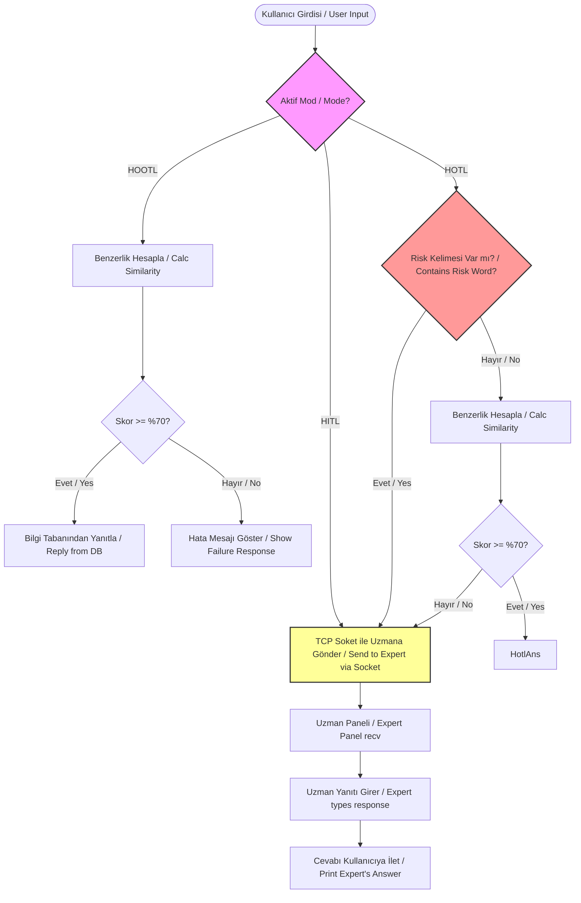

# 🌿 Bitki Bakımı Asistanı (Plant Care Assistant)

[](https://www.python.org/)
[](LICENSE)
[]()
[]()

[TR] Bu proje, evde bitki yetiştiren amatör bitki severlerin bitki sağlığı sorunlarında (sararma, solma, fazla sulama vb.) ilk yardım niteliğinde tavsiyeler alabileceği melez bir chatbot (sohbet robotu) uygulamasıdır. Proje, otonom kararlar ile insan uzman (Ziraat Mühendisi / Botanik Uzmanı) desteğini TCP Soket bağlantısı üzerinden birleştiren üç farklı hibrit etkileşim modu (HOOTL, HITL, HOTL) sunar.

[EN] This project is a hybrid chatbot application designed to help amateur plant lovers get first-aid advice on plant health issues (yellowing, wilting, overwatering, etc.). The project features three hybrid interaction modes (HOOTL, HITL, HOTL) combining autonomous decision-making with expert assistance (Agronomist / Botanist) via TCP Socket connections.

---

## 📌 İçindekiler / Table of Contents
1. [Özellikler / Features](#-özellikler--features)
2. [Çalışma Modları / Modes of Operation](#%EF%B8%8F-çalışma-modları--modes-of-operation)
3. [Akış Diyagramı / Workflow Diagram](#%EF%B8%8F-akış-diyagramı--workflow-diagram)
4. [Soket Haberleşmesi ve Mimari / Socket Architecture](#-soket-haberleşmesi-ve-mimari--socket-architecture)
5. [Karakter Eşleştirme Algoritması / Character Matching Algorithm](#-karakter-eşleştirme-algoritması--character-matching-algorithm)
6. [Kurulum ve Çalıştırma / Installation & Running](#-kurulum-ve-çalıştırma--installation--running)

---

## 🌟 Özellikler / Features
- **3 Farklı Çalışma Modu (3 Interaction Modes)**: HOOTL, HITL ve HOTL entegrasyonu.
- **TCP Soket Bağlantısı (TCP Socket Connection)**: Bot ve Botanik Uzmanı paneli arasında gerçek zamanlı veri iletimi.
- **Gelişmiş Harf Eşleştirme (Custom Character Matching)**: Kullanıcının yazım hatalarını tolere edebilen özel benzerlik skoru hesaplama algoritması.
- **Dinamik Bilgi Tabanı (Dynamic Knowledge Base)**: `bilgi.txt` dosyası üzerinden kolayca genişletilebilen soru-cevap matrisi.
- **Risk Analizi (Risk Analysis)**: Belirli anahtar kelimelerde ("böcek", "mantar", "çürüme", "ölüyor") durumu doğrudan uzmana aktarma yeteneği.

---

## ⚙️ Çalışma Modları / Modes of Operation

### 🤖 1. HOOTL (Human-Out-Of-The-Loop)
- **TR:** Bot tamamen otonomdur. `bilgi.txt` tabanındaki bilgilerle eşleştirme yapar. Eşleşme skoru %70'in altındaysa veya bilgi tabanında cevap bulunamazsa uzmana bağlanmaz, "Soruyu anlayamadım" der.
- **EN:** The bot is fully autonomous. It queries `bilgi.txt`. If similarity score is under 70%, it does not connect to the expert and output an "I couldn't understand your question" response.

### 👥 2. HITL (Human-In-The-Loop)
- **TR:** Bot pasiftir. Gelen tüm soruları doğrudan TCP soket üzerinden `expert.py` paneline (Botanik Uzmanına) gönderir. Uzmanın yazdığı cevabı kullanıcıya iletir.
- **EN:** The bot is passive. It forwards all user messages directly to `expert.py` via TCP socket and relays the expert's response back to the user.

### 🔄 3. HOTL (Human-On-The-Loop)
- **TR:** Hibrit moddur. Bot önce soruyu analiz eder:
  - Eğer girdi **Risk Kelimeleri** ("böcek", "çürüme", "mantar", "hastalık", "kurt", "ölüyor") içeriyorsa,
  - Veya bilgi tabanı eşleşme skoru **%70'in altındaysa (Belirsizlik)**,
  durumu doğrudan soket üzerinden Botanik Uzmanına yönlendirir. Diğer basit durumlarda (sulama, ışık vb.) bot kendisi cevap verir.
- **EN:** Hybrid mode. The bot first analyzes the input:
  - If it contains **Risk Words** ("böcek", "çürüme", "mantar", "hastalık", "kurt", "ölüyor"),
  - Or if the database match score is **under 70% (Uncertainty)**,
  it routes the query to the Expert. For simple queries (watering, light, etc.), the bot replies autonomously.

---

## 🗺️ Akış Diyagramı / Workflow Diagram



---

## 🔌 Soket Haberleşmesi ve Mimari / Socket Architecture
Uygulama, istemci-sunucu (Client-Server) mimarisinde çalışır:
- **Sunucu (Server - `expert.py`)**: `localhost` üzerinde `5000` portunu dinler (`AF_INET`, `SOCK_STREAM`). Bot'tan gelen acil durum mesajlarını alır, terminalden uzmanın girdisini bekler ve cevabı bota geri yollar.
- **İstemci (Client - `bot.py`)**: Kullanıcı girdisine göre gerektiğinde `5000` portuna TCP bağlantısı kurarak soruyu iletir ve yanıtı bekler (blocking socket).

---

## 🔍 Karakter Eşleştirme Algoritması / Character Matching Algorithm
Kullanıcı girdisini daha doğru ve anlamlı analiz etmek için Python'un yerleşik `difflib.SequenceMatcher` sınıfını kullanan kelime tabanlı yeni bir `yaklasik_esitlik` algoritması uygulanmıştır:
1. Girdi ve anahtar kelimeler küçük harfe dönüştürülür.
2. Kullanıcının girdisi kelimelere (boşluklara göre) ayrılır.
3. Eğer bilgi tabanındaki anahtar kelime, kullanıcının girdisinin içinde doğrudan geçiyorsa (substring olarak), %100 eşleşme kabul edilir.
4. Doğrudan eşleşme yoksa, girdideki her kelime ile anahtar kelime arasında `difflib.SequenceMatcher(None, anahtar, kelime).ratio() * 100` formülüyle benzerlik skoru hesaplanır.
5. En yüksek benzerlik skorunu üreten anahtar kelime tercih edilir.
   - *Bu algoritma, rastgele harflerin torba yöntemiyle birleşmesini önler ve yalnızca anlamlı/yakın kelime eşleşmelerinde yüksek skor verir.*

---

## 🚀 Kurulum ve Çalıştırma / Installation & Running

### Gereksinimler / Prerequisites
- Python 3.8 veya üzeri yüklü olmalıdır. (Python 3.8+ required)

### Adım 1: Depoyu Klonlayın / Clone the Repo
```bash
git clone https://github.com/KULLANICI_ADINIZ/plant-care-assistant-bot.git
cd plant-care-assistant-bot
```

### Adım 2: Uzman Panelini Başlatın (HITL/HOTL için Gerekli) / Start Expert Panel
Farklı bir terminal açın ve uzmanın dinleyeceği sunucuyu başlatın:
```bash
python expert.py
```

### Adım 3: Botu İstediğiniz Modda Çalıştırın / Run the Bot
Yeni bir terminalde botu başlatmak için aşağıdaki komutlardan birini seçin:

*   **HOOTL Modu (Otonom):**
    ```bash
    python bot.py hootl
    ```
*   **HITL Modu (Tam Uzman Denetimi):**
    ```bash
    python bot.py hitl
    ```
*   **HOTL Modu (Hibrit Denetim):**
    ```bash
    python bot.py hotl
    ```

---

## 📄 Lisans / License
Bu proje [MIT Lisansı](LICENSE) altında lisanslanmıştır.
