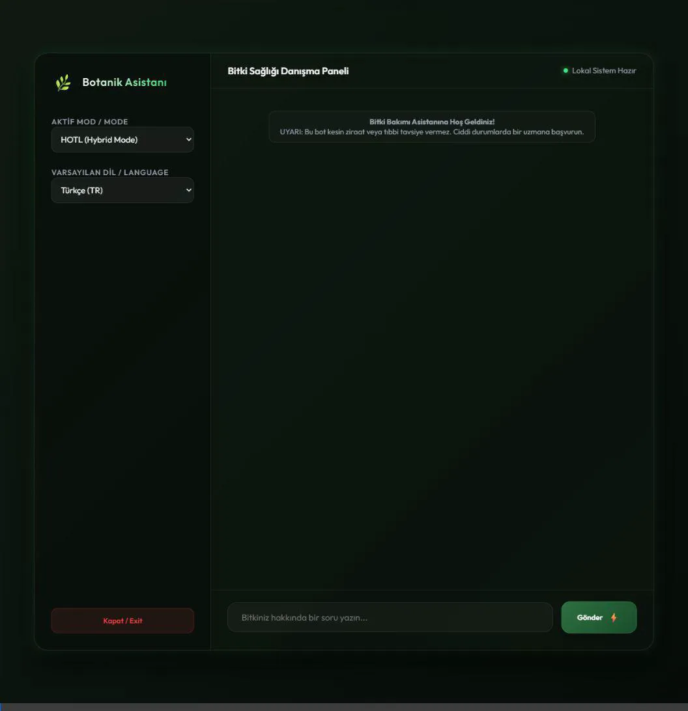
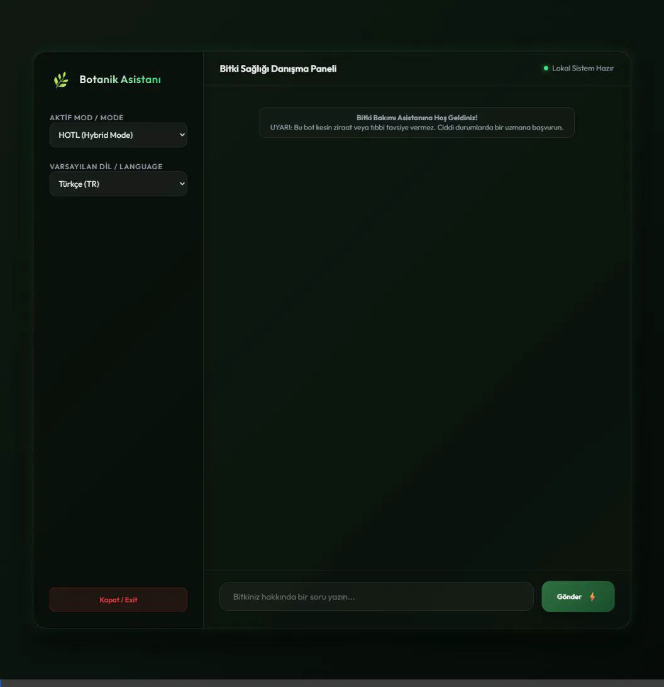
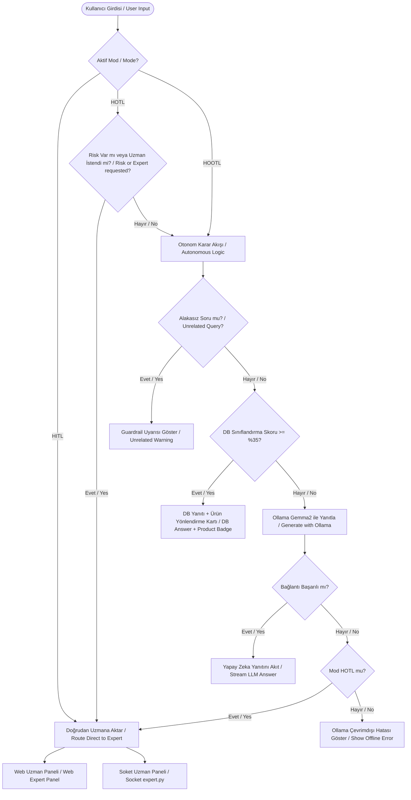

# 🌿 Bitki Bakımı Asistanı (Plant Care Assistant)

[](https://www.python.org/)
[](LICENSE)
[](https://flask.palletsprojects.com/)
[]()
[]()

[TR] Bu proje; bitki severlerin bitki sağlığı (sararma, kuruma, böceklenme vb.) sorunlarında tavsiyeler alabileceği, yapay zeka ve gerçek uzman desteğini bir araya getiren modern ve hibrit bir chatbot uygulamasıdır. Proje, otonom yapay zeka (Ollama ve ML Sınıflandırma) ile gerçek insan uzman (Ziraat Mühendisi / Botanik Uzmanı) desteğini hem komut satırı hem de şık bir web arayüzü üzerinden birleştirir.

[EN] This project is a modern hybrid chatbot application designed to help plant lovers get advice on plant health issues (yellowing, wilting, pest infestation, etc.). It combines autonomous AI (Ollama and ML classification) with human expert (Botanist) support, accessible via both a CLI interface and a modern glassmorphism web dashboard.

---

## 📌 İçindekiler / Table of Contents
1. [Yeni Eklenen Özellikler (Versiyon Farkları)](#-yeni-eklenen-özellikler-versiyon-farkları)
2. [Görsel Doğrulama ve Testler / Demos](#-görsel-doğrulama-ve-testler--demos)
3. [Çalışma Modları / Modes of Operation](#%EF%B8%8F-çalışma-modları--modes-of-operation)
4. [Mimari ve Akış / Architecture & Workflow](#-mimari-ve-akış--architecture--workflow)
5. [Kurulum ve Çalıştırma / Installation & Running](#-kurulum-ve-çalıştırma--installation--running)

---

## 🚀 Yeni Eklenen Özellikler (Versiyon Farkları)

Proje, basit komut satırı tabanlı soket botundan zengin özelliklere sahip tam kapsamlı bir web uygulamasına dönüştürülmüştür. Yapılan değişiklikler ve eklenen yeni özellikler:

*   **💻 Modern Web Arayüzü (Web Client & Dashboard)**: 
    *   Kullanıcı için **cam efekti (glassmorphism)** ile tasarlanmış modern bir sohbet arayüzü (`templates/index.html`).
    *   Ziraat uzmanları için gerçek zamanlı, bildirimli ve canlı **Uzman Operatör Yönetim Paneli** (`templates/expert.html`).
*   **🧠 Makine Öğrenmesi (ML) Sınıflandırma**:
    *   Eski harf eşleştirme algoritması silindi; yerine TF-IDF ve Lojistik Regresyon kullanan bir makine öğrenmesi modeli (`train.py`, `dataset.json`) getirildi.
*   **🦙 Yerel Yapay Zeka (Ollama)**:
    *   Veri tabanında bulunmayan sorular için yerel dil modeli (Ollama - `gemma2:2b`) entegre edildi.
*   **🔗 E-Ticaret Ürün Yönlendirmeleri**:
    *   Toprak, saksı veya gübre konularında otomatik olarak ilgili e-ticaret sitenize yönlendiren şık **ürün kartları** eklendi.
*   **🗣️ Çoklu Dil Desteği (tr/en)**:
    *   İşletim sistemi dilini otomatik algılama ve web arayüzünden tek tıkla anlık Türkçe/İngilizce dil değişimi sağlandı.
*   **🔒 Kalıcı Sohbet Oturumları (Persistent Session)**:
    *   Uzman paneli ile istemci arasında kalıcı oturum yönetimi sağlandı. Uzman **"Bitir"** butonuna basana kadar sohbet tek bir kartta devam eder.
    *   Sohbet uzman tarafından bitirildiğinde kullanıcı ekranına anında `[Sistem] Sohbet oturumu uzman tarafından sonlandırılmıştır.` uyarısı düşer.

---

## 📸 Görsel Doğrulama ve Testler / Demos

### 1. Mod Bazlı Bağlantı ve Yönlendirme Mantığı (HITL, HOOTL, HOTL)
Bu animasyonda, mod seçimleri arasındaki farklar, HITL modunun doğrudan uzmana bağlanması, HOOTL modunun otonom yapısı ve HOTL modunun uzmanı yalnızca gerektiğinde çağırması gösterilmektedir:



### 2. Uzman Oturumu Sonlandırma ve Sistem Bildirimi
Aşağıda, uzman panelindeki **"Bitir"** butonu tıklandığında oturumun nasıl sonlandırıldığı ve kullanıcı ekranına sistem uyarısının nasıl yansıtıldığı gösterilmektedir:



---

## ⚙️ Çalışma Modları / Modes of Operation

### 🤖 1. HOOTL (Human-Out-Of-The-Loop)
*   **TR:** Bot tamamen otonomdur. Eğitilmiş ML sınıflandırma modeline göre veri tabanından (`knowledge.txt`) cevap arar. Eğer eşleşme bulunamazsa yerel LLM'e (Ollama) başvurur. Ollama kapalı olsa dahi **asla uzmana bağlanmaz**, otonom kalarak sistem offline uyarısı verir.
*   **EN:** Fully autonomous. Queries the database using ML classification, falling back to Ollama if needed. It never connects to the expert under any circumstances.

### 👥 2. HITL (Human-In-The-Loop)
*   **TR:** Bot pasiftir. Guardrail veya yapay zeka filtrelerine girmeden gelen tüm mesajları doğrudan **Uzman Yönetim Paneline** (veya arka plandaki `expert.py` soket sunucusuna) yönlendirir.
*   **EN:** The bot immediately escalates all incoming questions directly to the expert panel, bypassing any AI or database classification.

### 🔄 3. HOTL (Human-On-The-Loop)
*   **TR:** Hibrit moddur. Aşağıdaki 3 koşuldan biri gerçekleştiğinde **gerek duyulduğu için** uzmana bağlanır:
    1.  Kullanıcı girdisinde **riskli kelimeler** ("böcek", "çürüme", "hastalık", "kurt" vb.) algılandığında.
    2.  Kullanıcı doğrudan **uzman yardımı talep ettiğinde** ("uzman", "operatör", "bağlan" vb.).
    3.  Yerel LLM (Ollama) sunucusu kapalı olduğunda (otomatik yedekleme).
    *   *Bu 3 durum haricinde bitki bakımıyla ilgili sorular otonom cevaplanır.*
*   **EN:** Hybrid mode. The bot replies autonomously unless triggered by: plant risk keywords, direct expert request keywords, or local AI offline fallback.

---

## 🗺️ Akış Diyagramı / Workflow Diagram



---

## 🔌 Soket ve Web Mimarisi / Architecture

Uygulama çift kanallı bir uzman paneli desteğine sahiptir:
1.  **Web Paneli (Flask - SSE)**: Kullanıcı tarayıcıda uzman moduna geçtiğinde `/api/expert/stream` üzerinden uzman paneline anlık bildirim gider. Uzman web üzerinden sohbeti canlı takip edebilir ve "Bitir" diyene kadar görüşmeyi sürdürebilir.
2.  **Soket Paneli (TCP Socket)**: Web paneli açık değilse sistem yedek olarak `expert.py` soket sunucusuna TCP (5000 portu) üzerinden bağlanarak terminalden uzmanın yanıt yazmasını bekler.

---

## 🚀 Kurulum ve Çalıştırma / Installation & Running

### Gereksinimler / Prerequisites
- Python 3.8 veya üzeri (Python 3.8+ required)
- Pip paketleri: `flask`, `joblib`, `scikit-learn`
- Yerel yapay zeka için bilgisayarınızda **Ollama** yüklü olmalı ve arka planda `gemma2:2b` modeli indirilmiş olmalıdır (`ollama run gemma2:2b`).

### Adım 1: Depoyu Klonlayın ve Bağımlılıkları Yükleyin
```bash
git clone https://github.com/KULLANICI_ADINIZ/plant-care-assistant-bot.git
cd plant-care-assistant-bot
pip install flask joblib scikit-learn
```

### Adım 2: Modeli Eğitin
Veri kümesindeki değişiklikleri modele kaydetmek için eğitim betiğini çalıştırın:
```bash
python train.py
```

### Adım 3: Uzman Paneli Soket Desteğini Başlatın (Arka Plan)
Soket yedekleme sunucusunu Türkçe dil parametresiyle başlatın:
```bash
python expert.py --lang tr
```

### Adım 4: Web Sunucusunu Başlatın
Ana web sunucusunu çalıştırın:
```bash
python app.py
```

### Adım 5: Tarayıcıdan Giriş Yapın
*   **Kullanıcı Arayüzü**: `http://127.0.0.1:8000`
*   **Uzman Arayüzü**: `http://127.0.0.1:8000/expert`

---

## 📄 Lisans / License
Bu proje [MIT Lisansı](LICENSE) altında lisanslanmıştır.
